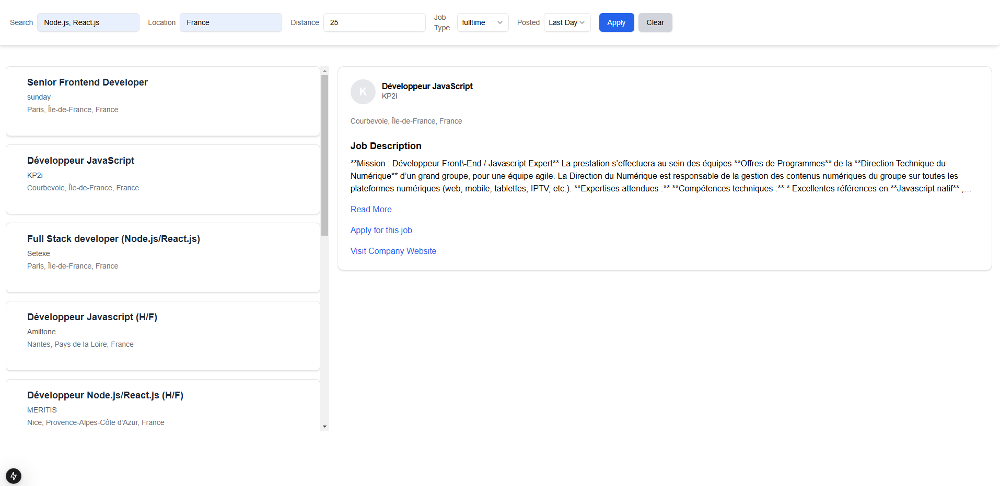

# linkedin-job-scrapper

# Job Fetcher API

This is a Flask-based API for fetching job listings based on search criteria such as job title, location, job type, and more. The API interacts with an external job parser tool (`JobSpy`) to fetch job data and provides functionality for pagination, validation, and exporting job listings in CSV format.

## Features

- **Job Search**: Allows users to fetch job listings based on criteria such as search term, location, job type, and others.
- **CSV Output**: Job data is saved as a CSV file which can be retrieved and viewed in the response.
- **Error Handling**: Detailed error messages are provided in case of issues with input parameters, external job parser execution, or file handling.
- **Customizable Parameters**: The API allows users to customize various parameters such as job search term, location, job type, and others.

## Installation

Follow these steps to set up the environment and run the Flask app.

### Prerequisites

Ensure that the following tools are installed on your machine:

- Python 3.8 or higher
- `pip` (Python package installer)

### Steps

1. Clone the repository:

```bash
   git clone <repository_url>
   cd <repository_directory>
```

2. Create a virtual environment (optional but recommended):

```bash
   python -m venv venv
```

3. Activate the virtual environment:
   - On macOS/Linux(first command) OR On Windows(second command)

```bash
    source venv\bin\activate
```
```bash
    .\venv\bin\activate
```

4. Install the dependencies:

```bash
    pip install -r requirements.txt
```

5. Ensure that the external jobsparser tool is installed and available in your system's PATH. If not, you will need to install it:

```bash
    pip install jobsparser
```

## Configuration

The API allows you to customize parameters such as search_term, location, results_wanted, etc., which are passed via the request body.
If needed, adjust the default values in the app.py file: - Default job search parameters (e.g., site, job_type, country, etc.) - Default output directory for CSV files (e.g., data)

## Running the Application

To run the Flask app locally, execute the following command:

```bash
    flask run
```

This will start the Flask development server at http://127.0.0.1:5000/.

## API Endpoints

### POST /fetch_jobs

Fetch job listings based on search criteria.

#### Request Body (JSON)

```bash
    {
  "search_term": "Software Engineer",
  "location": "London",
  "site": "linkedin",
  "results_wanted": 100,
  "distance": 25,
  "job_type": "fulltime",
  "country": "UK",
  "batch_size": 30,
  "output_dir": "data"
}
```

#### Query Parameters

- page (optional): The page number for pagination. Default is 1.
- per_page (optional): The number of job listings per page. Default is 10.

#### Response Body

A successful response includes a list of job listings and pagination information (if applicable).

```bash
    {
  "page": 1,
  "total_pages": 10,
  "per_page": 10,
  "total_results": 100,
  "jobs": [
    {
      "job_title": "Software Engineer",
      "company_name": "Tech Corp",
      "job_description": "Develop software applications...",
      "job_url": "https://www.linkedin.com/jobs/view/123456789"
    },
    ...
  ]
}
```

In case of an error, the response will include an appropriate error message:

```bash
{
  "error": "search_term and location must be strings."
}
```

#### Example using curl:

```bash
curl -X POST http://127.0.0.1:5000/fetch_jobs \
  -H "Content-Type: application/json" \
  -d '{
    "search_term": "Software Engineer",
    "location": "London",
    "results_wanted": 50
  }'
```

# Try Deployement 


Try it live : 
```bash
https://linkedin-job-scrapper.vercel.app/
```
